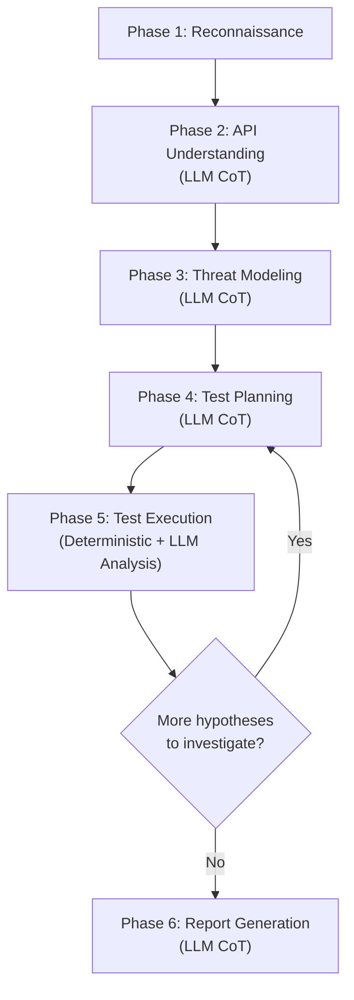

# Redesign PANDA as an LLM-Driven, Generalized API Security Agent

## Problem Statement

The current PANDA system has fundamental architectural issues that prevent it from being a useful, general-purpose API security tool:

1. **The LLM barely participates.** It's only used once — to generate a test plan of GET requests. All hypothesis generation, validation, planning logic, and report writing are hardcoded Python with string-matching heuristics (`"authorization" in text.lower()`).

2. **Hardcoded for BOLA only.** The report builder (`_build_local_report`) explicitly searches for BOLA patterns. `graph.py`'s hypothesis agent hardcodes two specific hypotheses. The tools in `tools.py` are a mock registry returning canned strings — they don't actually probe the real API.

3. **No business context understanding.** The agent never reasons about *what the API does* (user management? e-commerce? healthcare?) and therefore can't determine which vulnerability classes are relevant.

4. **No chain-of-thought reasoning.** There's no visible reasoning trace. The LLM doesn't explain *why* it's choosing certain probes or what it expects to learn.

5. **Two disconnected systems.** `multiagent.py` does the real HTTP work but uses the LLM trivially. `graph.py` has the right LangGraph structure but runs against canned mock tools. Neither uses the other.

## Proposed Architecture

A multi-phase, LLM-orchestrated pipeline where **every key decision is made by the LLM with structured chain-of-thought reasoning**, while safety guardrails remain in deterministic code.



### Phase Details

| Phase | Who Drives | What Happens |
|-------|-----------|--------------|
| **1. Recon** | Deterministic code | Fetch OpenAPI spec, probe each endpoint anonymously and with each auth profile, collect response shapes/status codes/headers |
| **2. API Understanding** | LLM (CoT) | Analyze the recon data to infer business context: "This is a user management API with admin reporting capabilities." Identify data models, relationships, auth patterns |
| **3. Threat Modeling** | LLM (CoT) | Based on the business context, generate ranked hypotheses from the OWASP API Top 10 and beyond: BOLA, BFLA, mass assignment, excessive data exposure, rate limiting gaps, etc. Each hypothesis includes reasoning for why it's relevant to *this specific API* |
| **4. Test Planning** | LLM (CoT) | For the top-ranked hypotheses, design specific test cases. The LLM explains what each probe tests, what it expects to see if the vulnerability exists, and what a safe outcome looks like |
| **5. Test Execution** | Deterministic HTTP + LLM analysis | Execute probes (policy-guarded: read-only, rate-limited). After each batch, the LLM analyzes results, updates hypothesis confidence, and decides whether to continue or pivot |
| **6. Report Generation** | LLM (CoT) | Synthesize all findings into a structured security report with executive summary, detailed findings with evidence, severity ratings, and remediation guidance |

## User Review Required

> [!IMPORTANT]
> **This is a significant rewrite.** The core files `multiagent.py`, `graph.py`, and `tools.py` will be substantially rewritten. `models.py` will be extended. `mock_api.py` stays untouched (it's the test target, not the agent). The existing functionality will be preserved as the new system is a superset.

> [!WARNING]
> **LLM token usage will increase.** The current system makes 1 LLM call. The new system will make 5-8+ calls per assessment (understanding, threat modeling, planning, per-batch analysis, report). This is the tradeoff for intelligence. We'll increase `max_tokens` from 500 to 2048 for reasoning-heavy calls.

## Open Questions

> [!IMPORTANT]
> **OWASP scope**: Should we limit to the OWASP API Security Top 10, or also include general web vulns (SSRF, header injection, etc.)? I'm proposing API Top 10 as the primary framework since this is an API security agent.

> [!IMPORTANT]  
> **LangGraph or linear pipeline?** The existing `graph.py` uses LangGraph but runs against mock tools. Should we:
> - **(A) Recommended**: Rebuild `multiagent.py` as a clean linear pipeline with an LLM-driven investigation loop (simpler, debuggable, the LLM decides when to loop)
> - **(B)** Refactor `graph.py` to use real HTTP tools and LLM-driven nodes (more complex, harder to debug, but uses the existing graph structure)
>
> I recommend **(A)** because the graph in `graph.py` is currently all hardcoded logic — there's nothing worth preserving. A clean pipeline in `multiagent.py` will be easier to iterate on.

## Proposed Changes

### Models — Data Structures
#### [MODIFY] [models.py](file:///c:/Users/KIIT/Desktop/Projects/Cybersecurity-Agent/panda/models.py)

Add new Pydantic models for the LLM's structured outputs:

- `APIUnderstanding` — business context, data models, auth patterns, relationships inferred by the LLM
- `ThreatHypothesis` — a specific vulnerability hypothesis with OWASP category, reasoning, relevance score, suggested probes
- `TestCase` — a planned probe with method, path, headers, expected outcomes, what it tests
- `TestAnalysis` — LLM's analysis of a batch of results: updated confidences, new observations, next steps
- `Finding` — a confirmed or suspected vulnerability with severity, evidence chain, remediation
- `SecurityReport` — the full structured report

---

### Core Agent — LLM-Driven Pipeline  
#### [MODIFY] [multiagent.py](file:///c:/Users/KIIT/Desktop/Projects/Cybersecurity-Agent/panda/multiagent.py)

**Major rewrite.** The new flow:

1. **Keep**: `_load_environment()`, `_build_llm()`, `_base_url()`, `_discover_api()` (recon), `_auth_profiles()`, `_emit_event()`, `_response_evidence()`, `_write_markdown_report()`, `main()` entry point
2. **Replace `_plan_tests()`** with `_understand_api()` → LLM call that produces `APIUnderstanding` with CoT reasoning
3. **New `_model_threats()`** → LLM call that produces ranked `ThreatHypothesis` list with CoT reasoning for each
4. **New `_plan_investigation()`** → LLM call that designs `TestCase` list for top hypotheses, with CoT explaining expected outcomes
5. **Replace `_execute_test_plan()`** with `_execute_and_analyze()` → Execute tests deterministically, then LLM analyzes the results batch, updates hypothesis confidences, decides whether to loop
6. **Replace `_build_local_report()`** with `_generate_report()` → LLM synthesizes the full report with severity ratings and remediation
7. **New `_llm_call()`** helper — Centralized LLM invocation with structured output parsing, CoT extraction, retry logic, and event logging
8. **Remove**: `_baseline_test_plan()`, `_object_values()`, `_ensure_authorization_coverage()`, `_build_local_report()` and all the hardcoded BOLA detection logic

**Key design principle**: Every LLM call gets a system prompt that includes:
- The full recon data (what endpoints exist, their schemas, auth requirements)
- All accumulated evidence so far
- A clear instruction to reason step-by-step before deciding
- A structured output format (JSON schema)

---

### Safety & Execution Layer
#### [MODIFY] [tools.py](file:///c:/Users/KIIT/Desktop/Projects/Cybersecurity-Agent/panda/tools.py)

Replace the `MockToolRegistry` with a `LiveHTTPExecutor` class:

- `execute_test(base_url, test_case, auth_profiles)` → Runs a single test case against the real API
- **Policy enforcement**: Only allows GET/HEAD by default. POST/PUT/PATCH/DELETE require explicit opt-in flag. No request bodies unless explicitly allowed.
- **Rate limiting**: Built-in per-minute rate limiter
- **Response capture**: Returns structured evidence including status code, headers, body summary (truncated), timing

---

### Graph (Deferred)
#### [MODIFY] [graph.py](file:///c:/Users/KIIT/Desktop/Projects/Cybersecurity-Agent/panda/graph.py)

For now, keep `graph.py` as-is but mark it as deprecated/legacy. The new intelligence lives in `multiagent.py`. We can revisit porting to LangGraph once the core pipeline is proven.

---

### Package Exports
#### [MODIFY] [__init__.py](file:///c:/Users/KIIT/Desktop/Projects/Cybersecurity-Agent/panda/__init__.py)

Update exports to reflect new public API.

---

### Mock API (No Changes)
#### [NO CHANGE] [mock_api.py](file:///c:/Users/KIIT/Desktop/Projects/Cybersecurity-Agent/panda/mock_api.py)

This is the test target, not part of the agent. No changes needed.

## Example: What the New Agent's Reasoning Will Look Like

```
[phase=understanding] LLM reasoning:
  "This API has a /users endpoint returning user lists and a /users/{id} 
   endpoint returning individual user details including profile data. There's
   an /admin/reports endpoint restricted to admin tokens. The API appears to
   be a user management system with admin reporting capabilities.
   
   Key observations:
   - User profiles contain department, manager, and API key hints
   - The /users list is accessible without authentication
   - Individual user details require authentication but may not enforce ownership
   - Admin reports are properly gated behind admin tokens"

[phase=threat_modeling] LLM reasoning:
  "Given this is a user management API, the most relevant threats are:
   
   1. BOLA (API1:2023) - HIGH relevance: /users/{id} accepts arbitrary IDs.
      A user-token holder might access other users' profiles.
   2. Broken Authentication (API2:2023) - MEDIUM: /users list is unauthenticated,
      potentially leaking user enumeration data.
   3. Excessive Data Exposure (API3:2023) - HIGH: profile contains API key hints
      and organizational hierarchy data.
   4. BFLA (API5:2023) - MEDIUM: Need to check if user-token can access
      /admin/reports.
   5. Security Misconfiguration (API8:2023) - LOW: /security-context endpoint
      exposes auth/authz metadata publicly."

[phase=test_planning] LLM reasoning:
  "For BOLA hypothesis: I'll request /users/1 and /users/2 with user-token.
   If both return 200 with different user data, BOLA is confirmed.
   Expected safe outcome: 403 when requesting a user ID that doesn't belong
   to the token holder."
```

## Verification Plan

### Automated Tests
```powershell
# Start mock API
python panda/mock_api.py &

# Run the agent against mock API
python -m panda.multiagent http://127.0.0.1:8000

# Verify report is generated in reports/ directory
dir reports/
```

### Manual Verification
- Review the generated report for:
  - Business context section (does it correctly identify the API's purpose?)
  - Threat model (does it identify relevant OWASP categories, not just BOLA?)
  - Evidence chain (does each finding trace back to specific HTTP responses?)
  - CoT reasoning visible in console output
  - Remediation advice that's specific to the findings, not generic boilerplate
- Compare report quality to the [existing report](file:///c:/Users/KIIT/Desktop/Projects/Cybersecurity-Agent/reports/panda_report_20260917T055211Z.md) — new report should be substantially richer
